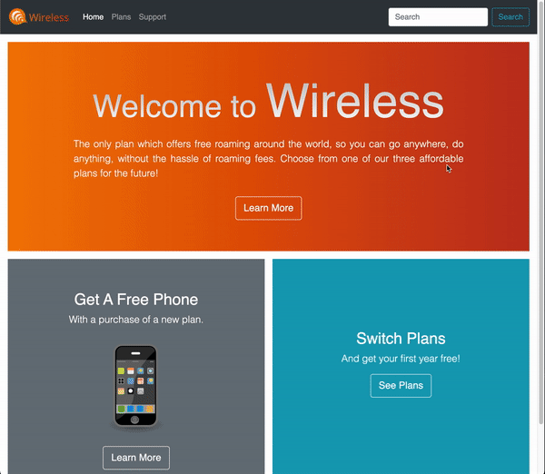

# wireless

Wireless is a responsive mobile network website, which allows the user to easily select plans.

## Technologies Used

- jQuery
- JavaScript ES6
- Bootstrap 4
- CSS3
- HTML5

## Live Demo

Try the application live at [https://nickkniola.github.io/wireless](https://nickkniola.github.io/wireless)

## Features
- User can select a wireless plan
- User can search the site for a relevant page
- User can submit a form for the selected plan
- User can submit a support form

## Preview


## Development

### Getting Started

1. Clone the repository.

    ```shell
    git clone https://github.com/nickkniola/wireless.git
    cd wireless
    ```

2. Open index.html in the browser
